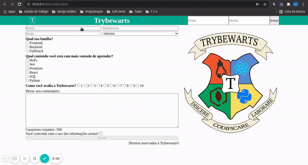
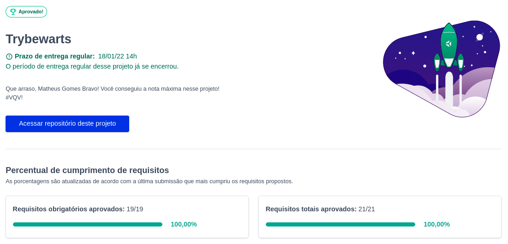

# Trybewarts
Projeto feito enquanto estudava na [Trybe](https://www.betrybe.com/), utilizando HTML, CSS, Javascript e DOM no módulo de fundamentos, o objetivo era praticar formulários e trabalho em equipe. Entregue com 100% dos requisitos.

## Direitos autorais

Esse projeto foi desenvolvido por mim ([Matheus Gomes](https://www.linkedin.com/in/matheusgb/)) e ([Raoni Chaves](https://www.linkedin.com/in/raoni-chaves-costa-0b5918211/)) apenas visando o aprendizado.

